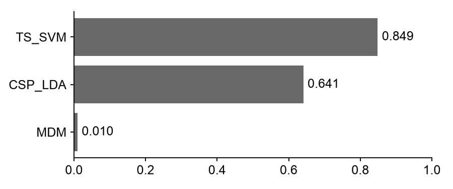
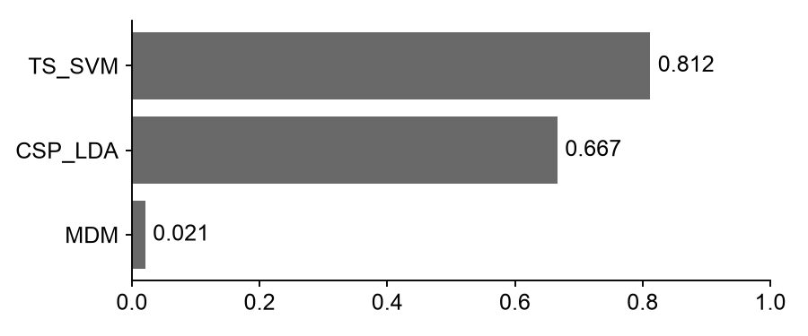
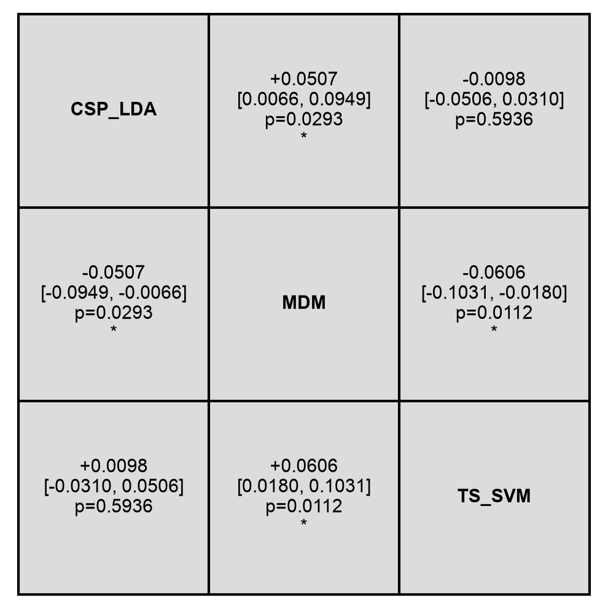
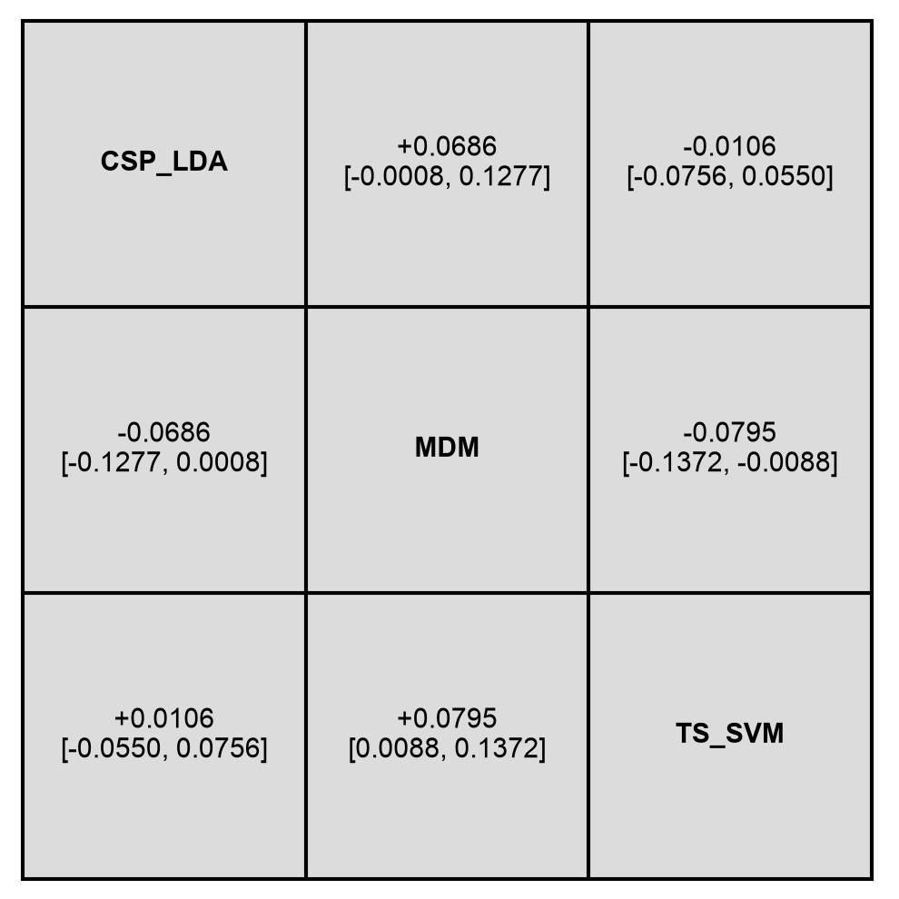
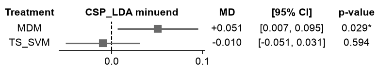
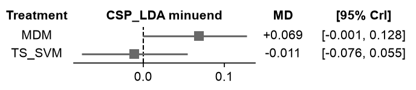
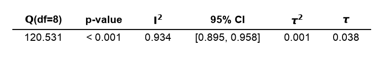
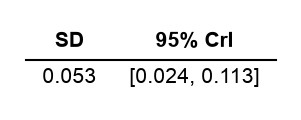
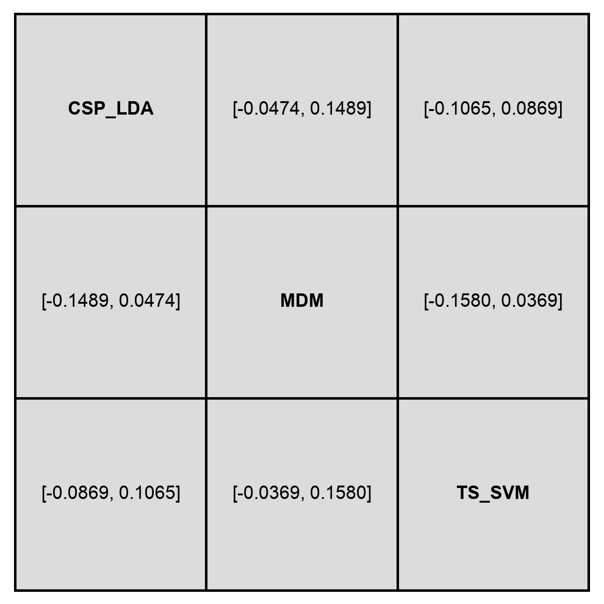
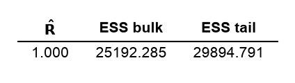

# Plots

Continuing the example from [Results](results.md), using the `freq` and `bayes` dicts produced there. Datasets are treated as independent studies and pipelines as treatments, so every plot below compares CSP+LDA, TS+SVM, and MDM pairwise across the five MOABB datasets. Every function below returns a `matplotlib.figure.Figure`.

```python
from moabbr.plots import (
    league_table,
    forest_plot,
    ranking_plot,
    heterogeneity_table,
    prediction_table,
    convergence_table,
)
```

Horizontal bar chart ranking each pipeline by its rank score (P-score for NMA, SUCRA for BNMA). Both scores range from 0 to 1, and pipelines are sorted highest-to-lowest so the best-performing pipeline appears at the top. A score close to 1 means a pipeline tends to outperform the others across the pairwise comparisons; a value near 0 means the opposite.

```python
ranking_plot(freq)
ranking_plot(bayes)
```




Grid of pairwise pipeline comparisons, showing the mean difference (row minus column) and confidence or credible interval for each pair. Diagonal cells show the pipeline name rather than a self-comparison. NMA cells additionally include the p-value for that pairwise contrast; BNMA cells report only the credible interval, since there's no Bayesian equivalent of a p-value.

```python
league_table(freq)
league_table(bayes)
```




Forest plot of every pipeline relative to a chosen reference, sorted by effect size. Here CSP+LDA is the reference, so each row shows how much better or worse the other pipelines perform relative to it, with a marker for the mean difference and whiskers for the interval. NMA intervals are labeled `[95% CI]`; BNMA intervals are labeled `[95% CrI]`.

```python
forest_plot(freq, reference="CSP+LDA")
forest_plot(bayes, reference="CSP+LDA")
```




Summary table of heterogeneity statistics (Q, p-value, I², and τ for NMA; posterior SD and 95% credible interval for BNMA). I² is the proportion of total variance attributable to between-dataset heterogeneity rather than sampling error, while τ (or its Bayesian analogue, the posterior SD) is the between-dataset standard deviation on the effect scale itself. A significant Q p-value or a large I² suggests the pipelines' relative performance isn't consistent across the five datasets.

```python
heterogeneity_table(freq)
heterogeneity_table(bayes)
```




Grid of 95% prediction intervals for each pair of pipelines, applicable to NMA results only. Unlike the confidence intervals in the league table, which describe uncertainty in the estimated average effect, prediction intervals translate the between-dataset heterogeneity (τ) into the range of effects you'd expect on a new, unseen dataset.

```python
prediction_table(freq)
```



Summary table of MCMC convergence diagnostics (max R-hat, min ESS bulk, and min ESS tail), applicable to BNMA results only. R-hat compares between-chain and within-chain variance and should be below 1.01; ESS bulk and tail estimate the effective number of independent posterior samples and should each exceed 400. Values outside these thresholds indicate the sampler hasn't converged, and the posterior estimates above may be unreliable.

```python
convergence_table(bayes)
```

